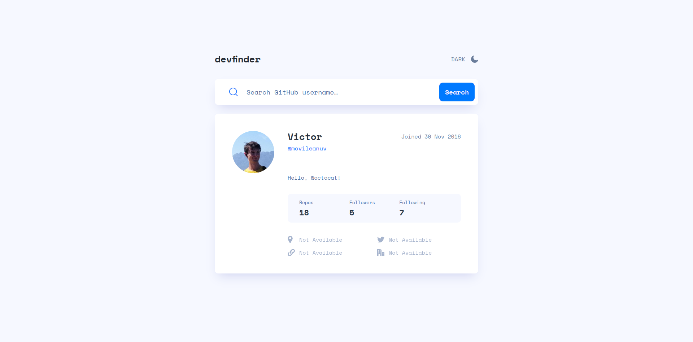

# Frontend Mentor - GitHub user search app solution

This is a solution to the [GitHub user search app challenge on Frontend Mentor](https://www.frontendmentor.io/challenges/github-user-search-app-Q09YOgaH6). Frontend Mentor challenges help you improve your coding skills by building realistic projects. 

## Table of contents

- [Overview](#overview)
  - [The challenge](#the-challenge)
  - [Screenshot](#screenshot)
  - [Links](#links)
- [My process](#my-process)
  - [Built with](#built-with)
  - [What I learned](#what-i-learned)
  - [Continued development](#continued-development)
  - [Useful resources](#useful-resources)
- [Author](#author)

## Overview

### The challenge

Users should be able to:

- View the optimal layout for the app depending on their device's screen size
- See hover states for all interactive elements on the page
- Search for GitHub users by their username
- See relevant user information based on their search
- Switch between light and dark themes
- **Bonus**: Have the correct color scheme chosen for them based on their computer preferences. _Hint_: Research `prefers-color-scheme` in CSS.

### Screenshot

### Links

- Solution URL: [Frontendmentor](https://www.frontendmentor.io/solutions/github-user-search-app-with-tailwindcss-and-pure-js-dk6qMY9FyC)
- Live Site URL: [Netlify](https://github-user-search-app-movileanuv.netlify.app/)

## My process

### Built with

- JavaScript - interaction
- Tailwindcss - styling
- Parcel - bundling

### What I learned

- dark mode styling (made easy thanks to tailwindcss)
- mobile first styling

### Continued development

- css grid
- mobile first styling

### Useful resources

- [tailwindcss.com](https://tailwindcss.com/) - This made styling easy

## Author

- Website - [minimalistdjango.com](https://minimalistdjango.com/)
- Frontend Mentor - [@movileanuv](https://www.frontendmentor.io/profile/movileanuv)
- Github - [@movileanuv](https://github.com/movileanuv)
